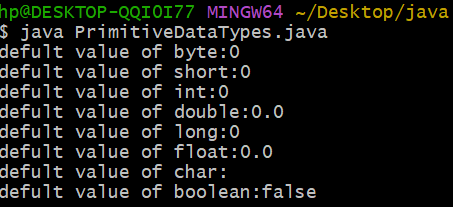
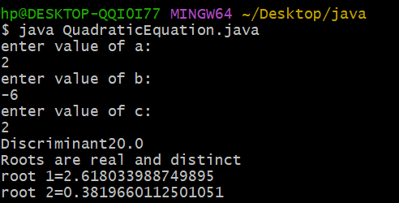

# EXPERIMENT 1A
##  PRIMITIVE DATA TYPES
```java
public class PrimitiveDatatypes
{
    byte b;
    short s; 
    int i;
    double d;
    long l;
    float f;
    char c;
    boolean bool;
    public static void main(String[]args)
    {
        PrimitiveDatatypes obj=new PrimitiveDatatypes();
        System.out.println("defult value of byte:"+obj.b);
        System.out.println("defult value of short:"+obj.s);
        System.out.println("defult value of int:"+obj.i); 
        System.out.println("defult value of double:"+obj.d);
        System.out.println("defult value of long:"+obj.l);
        System.out.println("defult value of float:"+obj.f);
        System.out.println("defult value of char:"+obj.c);
        System.out.println("defult value of boolean:"+obj.bool);
    }
}


```



## Experiment 1b
## title:Quadratic

```java
import java.util.Scanner; 
class Quadraticcequation{
 public static void main(String[]args) { 
Scanner Sc=new Scanner(System.in);
 double a,b,c,D; 
System.out.println("enter value of a:");
 a=Sc.nextDouble(); 
System.out.println("enter value of b:");
 b=Sc.nextDouble();
 System.out.println("enter value of c:");
 c=Sc.nextDouble();
 D=b*b-4*a*c;
 System.out.println("Discriminant"+D);
 if(D>0) { 
double root1=(-b+Math.sqrt(D))/(2*a);
 double root2=(-b-Math.sqrt(D))/(2*a); 
System.out.println("Roots are real and distinct");
 System.out.println("root 1="+root1);
 System.out.println("root 2="+root2);
 } 
else if(D==0) {
 double root=-b/(2*a); 
System.out.println("Roots are real and equal"); 
System.out.println("Root="+root);
 } 
else { 
double real=-b/(2*a); 
double imaginary=Math.sqrt(-D)/(2*a); 
System.out.println("Roots are complex and imaginary"); 
System.out.println("Root 1="+real+"+i"+imaginary); 
System.out.println("Root 2="+real+"-i"+imaginary); 
}
 
}
}


```
##output:


## OUTPUT:



